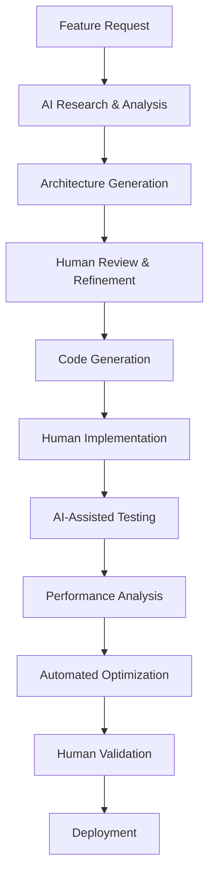

# @f-Unity-Development-AI-Workflows

## 🎯 Learning Objectives
- Create AI-enhanced Unity development workflows for 10x productivity
- Master stealth automation techniques for game development tasks
- Build intelligent code generation systems for Unity patterns
- Develop AI-assisted debugging and optimization workflows

## 🔧 Core AI-Enhanced Unity Workflows

### Intelligent Code Generation Pipeline
```yaml
Unity Pattern Generation:
  MonoBehaviour Templates:
    - Component-based architecture patterns
    - State machine implementations
    - Object pooling systems
    - Event-driven communication patterns

  System Architecture:
    - Singleton pattern variations
    - Observer pattern implementations
    - Command pattern for input handling
    - Factory patterns for object creation

  Performance Optimization:
    - Coroutine vs async/await decision trees
    - Memory allocation reduction patterns
    - Draw call optimization strategies
    - Mobile-specific optimization templates
```

### AI-Powered Development Assistant
```python
# Unity Development AI Assistant Framework
unity_ai_workflows = {
    "code_generation": {
        "component_creation": {
            "prompt": "Generate a Unity MonoBehaviour for {component_type} that handles {functionality}. Include proper Unity lifecycle methods, serialized fields for inspector configuration, and performance considerations.",
            "examples": [
                "PlayerController with movement and input handling",
                "InventorySystem with item management and UI updates",
                "EnemyAI with state machine and behavior trees"
            ]
        },
        
        "system_architecture": {
            "prompt": "Design a Unity system architecture for {game_feature} using {design_patterns}. Include class diagrams, component relationships, and Unity-specific implementation details.",
            "focus_areas": [
                "Scalability and maintainability",
                "Unity Inspector integration",
                "Performance implications",
                "Testing and debugging considerations"
            ]
        }
    }
}
```

### Automated Debug and Optimization Workflow
```csharp
// AI-Enhanced Debugging Patterns
public class AIAssistedDebugging
{
    // Intelligent Performance Monitoring
    [System.Diagnostics.Conditional("DEVELOPMENT_BUILD")]
    private void LogPerformanceMetrics()
    {
        // AI analyzes these patterns to suggest optimizations
        Debug.Log($"Frame Time: {Time.unscaledDeltaTime:F3}ms");
        Debug.Log($"Draw Calls: {UnityStats.drawCalls}");
        Debug.Log($"Memory Usage: {Profiler.GetTotalAllocatedMemory(0)}");
    }
    
    // AI-Suggested Error Handling Patterns
    private void HandleAIRecommendedErrorChecking()
    {
        // Generated based on common Unity pitfalls
        if (gameObject == null)
        {
            Debug.LogError("GameObject reference is null - check initialization order");
            return;
        }
        
        if (!Application.isPlaying)
        {
            Debug.LogWarning("Attempting runtime operation in edit mode");
            return;
        }
    }
}
```

## 🚀 AI/LLM Integration Opportunities

### Intelligent Asset Pipeline
```bash
# AI-Enhanced Asset Management
asset_automation:
  - Texture compression optimization based on usage analysis
  - Model LOD generation with quality assessment
  - Animation compression with motion quality preservation
  - Audio file optimization for platform requirements

# Smart Asset Organization
organization_ai:
  - Automatic folder structure generation based on project type
  - Asset dependency analysis and optimization
  - Unused asset detection and cleanup suggestions
  - Cross-reference validation for missing dependencies
```

### Code Review and Quality Assurance
```python
# AI-Powered Code Review System
code_quality_ai = {
    "pattern_analysis": {
        "unity_best_practices": [
            "Proper component lifecycle usage",
            "Memory allocation in Update loops",
            "Coroutine vs Update method decisions",
            "Serialization and Inspector optimization"
        ],
        
        "performance_review": [
            "Mobile performance impact assessment",
            "Draw call optimization opportunities",
            "Garbage collection pressure analysis",
            "Thread safety in Unity context"
        ]
    },
    
    "automated_suggestions": {
        "refactoring_opportunities": "Identify code that could benefit from Unity-specific design patterns",
        "optimization_hints": "Suggest performance improvements based on Unity profiler data",
        "architecture_improvements": "Recommend structural changes for better maintainability"
    }
}
```

### Intelligent Testing and QA
```yaml
AI-Enhanced Testing Workflows:
  Automated Test Generation:
    - Unity Test Runner integration
    - Component behavior validation
    - Performance regression testing
    - Cross-platform compatibility checks

  Bug Reproduction:
    - Automated bug report analysis
    - Test case generation from bug descriptions
    - Edge case identification based on code analysis
    - Platform-specific testing scenarios

  Quality Metrics:
    - Code coverage analysis with Unity-specific considerations
    - Performance benchmark tracking
    - Memory leak detection patterns
    - Build pipeline optimization
```

## 💡 Key Highlights

### **Stealth Automation Strategies**
```markdown
# Invisible Productivity Enhancement

## Background Processing
- **Asset Pipeline**: Automated texture compression and model optimization
- **Code Generation**: Template-based component creation with human review
- **Documentation**: Automatic API documentation from code comments
- **Build Process**: Intelligent platform-specific build optimization

## Human-AI Collaboration Patterns
- **Research Phase**: AI gathers Unity documentation and best practices
- **Design Phase**: AI suggests architecture patterns, human makes decisions
- **Implementation**: AI generates boilerplate, human adds game-specific logic
- **Testing**: AI identifies test scenarios, human validates functionality
- **Optimization**: AI analyzes performance data, human implements fixes
```

### **Unity-Specific AI Prompting Patterns**
```python
# Specialized Unity Development Prompts
unity_prompts = {
    "component_design": """
    Create a Unity MonoBehaviour component for {functionality}.
    Requirements:
    - Follow Unity component lifecycle best practices
    - Include appropriate [SerializeField] attributes for Inspector
    - Consider mobile performance implications
    - Use Unity's event system where appropriate
    - Include summary comments for public methods
    """,
    
    "performance_analysis": """
    Analyze this Unity code for performance issues:
    {code_snippet}
    
    Focus on:
    - Garbage collection allocation patterns
    - Draw call optimization opportunities  
    - Mobile-specific performance considerations
    - Memory usage efficiency
    - Thread safety in Unity context
    """,
    
    "architecture_review": """
    Review this Unity system architecture for:
    - Component communication patterns
    - Dependency management
    - Scalability considerations
    - Testing and debugging ease
    - Unity Inspector integration
    
    Suggest improvements using Unity best practices.
    """
}
```

### **Automated Development Pipeline**


### **Advanced Unity AI Integration**
```csharp
// AI-Enhanced Unity Development Tools
public class UnityAIIntegration : EditorWindow
{
    // AI-powered component creation
    [MenuItem("AI Tools/Generate Component")]
    public static void GenerateComponentWithAI()
    {
        // Interface for AI-assisted component creation
        // Human specifies requirements, AI generates template
        // Human reviews and customizes before implementation
    }
    
    // Intelligent performance analysis
    [MenuItem("AI Tools/Analyze Performance")]
    public static void AnalyzePerformanceWithAI()
    {
        // AI analyzes Unity Profiler data
        // Generates optimization suggestions
        // Provides implementation guidance
    }
    
    // Smart refactoring suggestions
    [MenuItem("AI Tools/Suggest Refactoring")]
    public static void SuggestRefactoringWithAI()
    {
        // AI analyzes codebase structure
        // Identifies improvement opportunities
        // Suggests Unity-specific design patterns
    }
}
```

### **Documentation and Knowledge Management**
```yaml
AI-Powered Documentation:
  Code Documentation:
    - Automatic XML documentation generation
    - Unity component usage examples
    - Performance impact documentation
    - Cross-platform compatibility notes

  Project Documentation:
    - Architecture decision records
    - Feature implementation guides
    - Troubleshooting and debugging guides
    - Best practices documentation

  Learning Resources:
    - Personalized Unity learning paths
    - Code pattern libraries
    - Performance optimization cookbooks
    - Platform-specific implementation guides
```

### **Quality Assurance Automation**
```python
# AI-Enhanced QA Workflow
qa_automation = {
    "static_analysis": {
        "code_quality": [
            "Unity best practices compliance",
            "Performance anti-pattern detection",
            "Memory leak potential identification",
            "Thread safety validation"
        ]
    },
    
    "dynamic_testing": {
        "performance_monitoring": [
            "Frame rate stability analysis",
            "Memory usage pattern tracking",
            "Draw call optimization verification",
            "Battery usage impact assessment"
        ]
    },
    
    "cross_platform_validation": {
        "platform_testing": [
            "iOS/Android compatibility verification",
            "Performance parity analysis",
            "Platform-specific feature testing",
            "Input handling validation"
        ]
    }
}
```

This AI-enhanced workflow system transforms Unity development from traditional manual coding to an intelligent, assisted development process while maintaining full human creative control and decision-making authority.