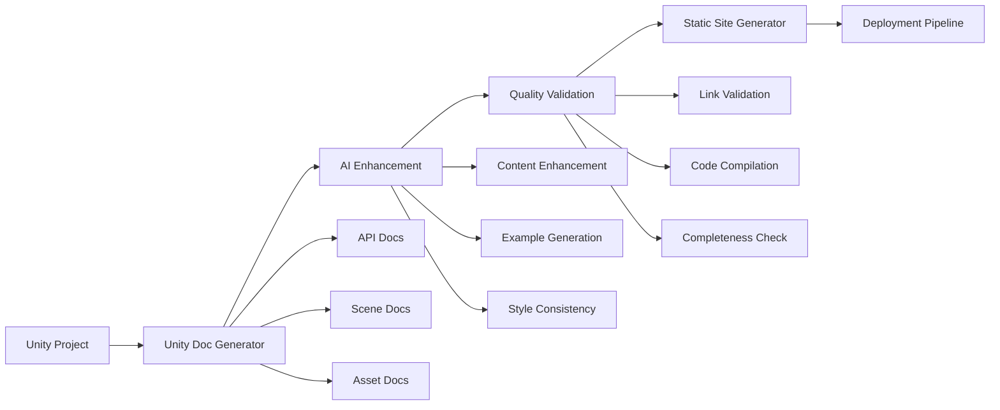

# @f-Documentation-Automation-Tools

## 🎯 Learning Objectives
- Master automated documentation generation tools for Unity development workflows
- Implement CI/CD pipelines that maintain documentation consistency and accuracy
- Develop custom Unity Editor tools for project-specific documentation needs
- Create AI-enhanced documentation workflows that scale with team growth

## 🔧 Essential Documentation Automation Stack

### Unity-Integrated Documentation Tools
```csharp
#if UNITY_EDITOR
using UnityEditor;
using System.IO;
using System.Text;
using System.Linq;

/// <summary>
/// Comprehensive Unity project documentation generator
/// </summary>
public class UnityDocumentationGenerator : EditorWindow
{
    private bool generateApiDocs = true;
    private bool generateSceneDocs = true;
    private bool generateAssetDocs = true;
    private bool generatePerformanceDocs = false;
    
    [MenuItem("Tools/Documentation/Generate Project Docs")]
    public static void ShowWindow()
    {
        GetWindow<UnityDocumentationGenerator>("Doc Generator");
    }
    
    private void OnGUI()
    {
        GUILayout.Label("Unity Documentation Generator", EditorStyles.boldLabel);
        
        generateApiDocs = EditorGUILayout.Toggle("Generate API Documentation", generateApiDocs);
        generateSceneDocs = EditorGUILayout.Toggle("Generate Scene Documentation", generateSceneDocs);
        generateAssetDocs = EditorGUILayout.Toggle("Generate Asset Documentation", generateAssetDocs);
        generatePerformanceDocs = EditorGUILayout.Toggle("Include Performance Metrics", generatePerformanceDocs);
        
        EditorGUILayout.Space();
        
        if (GUILayout.Button("Generate Documentation"))
        {
            GenerateDocumentation();
        }
        
        if (GUILayout.Button("Update Existing Documentation"))
        {
            UpdateDocumentation();
        }
    }
    
    private void GenerateDocumentation()
    {
        var outputPath = "Documentation/Generated/";
        Directory.CreateDirectory(outputPath);
        
        if (generateApiDocs) GenerateAPIDocumentation(outputPath);
        if (generateSceneDocs) GenerateSceneDocumentation(outputPath);
        if (generateAssetDocs) GenerateAssetDocumentation(outputPath);
        if (generatePerformanceDocs) GeneratePerformanceDocumentation(outputPath);
        
        AssetDatabase.Refresh();
        Debug.Log($"Documentation generated successfully at: {outputPath}");
    }
    
    private void GenerateAPIDocumentation(string outputPath)
    {
        var scripts = GetAllProjectScripts();
        var apiDoc = new StringBuilder();
        
        apiDoc.AppendLine("# API Reference");
        apiDoc.AppendLine();
        apiDoc.AppendLine("## Table of Contents");
        
        foreach (var script in scripts)
        {
            var analysis = AnalyzeScript(script);
            if (analysis.HasPublicAPI)
            {
                apiDoc.AppendLine($"- [{analysis.ClassName}](#{analysis.ClassName.ToLower()})");
            }
        }
        
        apiDoc.AppendLine();
        
        foreach (var script in scripts)
        {
            var analysis = AnalyzeScript(script);
            if (analysis.HasPublicAPI)
            {
                GenerateClassDocumentation(apiDoc, analysis);
            }
        }
        
        File.WriteAllText(Path.Combine(outputPath, "API-Reference.md"), apiDoc.ToString());
    }
    
    private void GenerateClassDocumentation(StringBuilder doc, ScriptAnalysis analysis)
    {
        doc.AppendLine($"## {analysis.ClassName}");
        doc.AppendLine();
        doc.AppendLine($"**Namespace**: `{analysis.Namespace}`");
        doc.AppendLine($"**Inheritance**: {analysis.BaseClass}");
        doc.AppendLine($"**Location**: `{analysis.FilePath}`");
        doc.AppendLine();
        
        if (!string.IsNullOrEmpty(analysis.Summary))
        {
            doc.AppendLine($"**Summary**: {analysis.Summary}");
            doc.AppendLine();
        }
        
        if (analysis.PublicMethods.Any())
        {
            doc.AppendLine("### Public Methods");
            foreach (var method in analysis.PublicMethods)
            {
                doc.AppendLine($"#### {method.Signature}");
                doc.AppendLine($"{method.Documentation}");
                doc.AppendLine();
                
                if (!string.IsNullOrEmpty(method.ExampleUsage))
                {
                    doc.AppendLine("**Example**:");
                    doc.AppendLine("```csharp");
                    doc.AppendLine(method.ExampleUsage);
                    doc.AppendLine("```");
                    doc.AppendLine();
                }
            }
        }
        
        if (analysis.PublicProperties.Any())
        {
            doc.AppendLine("### Public Properties");
            foreach (var property in analysis.PublicProperties)
            {
                doc.AppendLine($"#### {property.Name}");
                doc.AppendLine($"**Type**: `{property.Type}`");
                doc.AppendLine($"**Access**: {property.AccessLevel}");
                if (!string.IsNullOrEmpty(property.Documentation))
                {
                    doc.AppendLine($"**Description**: {property.Documentation}");
                }
                doc.AppendLine();
            }
        }
        
        doc.AppendLine("---");
        doc.AppendLine();
    }
}

/// <summary>
/// Data structure for script analysis results
/// </summary>
public class ScriptAnalysis
{
    public string ClassName { get; set; }
    public string Namespace { get; set; }
    public string BaseClass { get; set; }
    public string FilePath { get; set; }
    public string Summary { get; set; }
    public bool HasPublicAPI { get; set; }
    public List<MethodInfo> PublicMethods { get; set; } = new List<MethodInfo>();
    public List<PropertyInfo> PublicProperties { get; set; } = new List<PropertyInfo>();
}

public class MethodInfo
{
    public string Name { get; set; }
    public string Signature { get; set; }
    public string Documentation { get; set; }
    public string ExampleUsage { get; set; }
    public List<ParameterInfo> Parameters { get; set; } = new List<ParameterInfo>();
}

public class PropertyInfo
{
    public string Name { get; set; }
    public string Type { get; set; }
    public string AccessLevel { get; set; }
    public string Documentation { get; set; }
}
#endif
```

### Automated Scene Documentation
```csharp
#if UNITY_EDITOR
/// <summary>
/// Generates comprehensive scene documentation
/// </summary>
public static class SceneDocumentationGenerator
{
    [MenuItem("Tools/Documentation/Generate Scene Docs")]
    public static void GenerateSceneDocumentation()
    {
        var scenes = EditorBuildSettings.scenes;
        var outputPath = "Documentation/Scenes/";
        Directory.CreateDirectory(outputPath);
        
        foreach (var sceneAsset in scenes)
        {
            if (sceneAsset.enabled)
            {
                GenerateSceneDoc(sceneAsset.path, outputPath);
            }
        }
        
        GenerateSceneIndex(scenes, outputPath);
        AssetDatabase.Refresh();
    }
    
    private static void GenerateSceneDoc(string scenePath, string outputPath)
    {
        var sceneName = Path.GetFileNameWithoutExtension(scenePath);
        var currentScene = EditorSceneManager.GetActiveScene();
        
        // Open scene for analysis
        var scene = EditorSceneManager.OpenScene(scenePath, OpenSceneMode.Single);
        
        var doc = new StringBuilder();
        doc.AppendLine($"# Scene: {sceneName}");
        doc.AppendLine();
        doc.AppendLine($"**Path**: `{scenePath}`");
        doc.AppendLine($"**Build Index**: {GetSceneBuildIndex(scenePath)}");
        doc.AppendLine();
        
        // Analyze scene hierarchy
        var rootObjects = scene.GetRootGameObjects();
        doc.AppendLine("## Scene Hierarchy");
        doc.AppendLine();
        
        foreach (var rootObj in rootObjects)
        {
            DocumentGameObjectHierarchy(doc, rootObj, 0);
        }
        
        // Analyze components
        doc.AppendLine("## Key Components");
        doc.AppendLine();
        
        var allComponents = FindObjectsOfType<MonoBehaviour>();
        var componentGroups = allComponents
            .GroupBy(c => c.GetType())
            .OrderBy(g => g.Key.Name);
        
        foreach (var group in componentGroups)
        {
            doc.AppendLine($"### {group.Key.Name}");
            doc.AppendLine($"**Count**: {group.Count()}");
            doc.AppendLine($"**Purpose**: {GetComponentPurpose(group.Key)}");
            doc.AppendLine();
            
            // List GameObjects with this component
            foreach (var component in group.Take(5)) // Limit to first 5
            {
                doc.AppendLine($"- `{GetGameObjectPath(component.gameObject)}`");
            }
            
            if (group.Count() > 5)
            {
                doc.AppendLine($"- ... and {group.Count() - 5} more");
            }
            doc.AppendLine();
        }
        
        // Performance analysis
        doc.AppendLine("## Performance Profile");
        doc.AppendLine();
        
        var performanceMetrics = AnalyzeScenePerformance();
        doc.AppendLine($"**Total GameObjects**: {performanceMetrics.GameObjectCount}");
        doc.AppendLine($"**Active Renderers**: {performanceMetrics.RendererCount}");
        doc.AppendLine($"**Lights**: {performanceMetrics.LightCount}");
        doc.AppendLine($"**Audio Sources**: {performanceMetrics.AudioSourceCount}");
        doc.AppendLine($"**Estimated Draw Calls**: {performanceMetrics.EstimatedDrawCalls}");
        doc.AppendLine();
        
        // Save documentation
        var fileName = $"{sceneName}-Documentation.md";
        File.WriteAllText(Path.Combine(outputPath, fileName), doc.ToString());
        
        // Restore original scene
        if (currentScene.IsValid())
        {
            EditorSceneManager.OpenScene(currentScene.path);
        }
    }
    
    private static void DocumentGameObjectHierarchy(StringBuilder doc, GameObject obj, int depth)
    {
        var indent = new string(' ', depth * 2);
        var components = obj.GetComponents<Component>()
            .Where(c => c != null && !(c is Transform))
            .Select(c => c.GetType().Name);
        
        var componentList = components.Any() ? $" ({string.Join(", ", components)})" : "";
        doc.AppendLine($"{indent}- {obj.name}{componentList}");
        
        foreach (Transform child in obj.transform)
        {
            DocumentGameObjectHierarchy(doc, child.gameObject, depth + 1);
        }
    }
}
#endif
```

## 🚀 AI/LLM Integration Opportunities

### Intelligent Documentation Enhancement
```python
# AI-powered documentation improvement pipeline
class AIDocumentationEnhancer:
    def __init__(self, ai_client):
        self.ai_client = ai_client
        self.style_guide = self.load_style_guide()
    
    def enhance_unity_documentation(self, raw_docs):
        """Enhance raw documentation with AI improvements"""
        enhanced_docs = {}
        
        for doc_type, content in raw_docs.items():
            enhanced_content = self.enhance_content(content, doc_type)
            enhanced_docs[doc_type] = enhanced_content
        
        return enhanced_docs
    
    def enhance_content(self, content, doc_type):
        """Enhance specific document type with targeted improvements"""
        prompt = f"""
        Enhance this Unity {doc_type} documentation:
        
        {content}
        
        Improvements needed:
        - Add practical examples for complex concepts
        - Clarify Unity-specific terminology and behavior
        - Include performance implications where relevant
        - Ensure consistency with Unity coding standards
        - Add troubleshooting sections for common issues
        - Improve readability while maintaining technical accuracy
        
        Style Guide: {self.style_guide[doc_type]}
        """
        
        return self.ai_client.enhance(prompt)
    
    def generate_missing_sections(self, existing_docs, required_sections):
        """Generate missing documentation sections"""
        missing_sections = {}
        
        for section in required_sections:
            if section not in existing_docs:
                content = self.generate_section(section)
                missing_sections[section] = content
        
        return missing_sections
    
    def validate_documentation_completeness(self, docs):
        """AI-powered completeness validation"""
        prompt = f"""
        Analyze this Unity project documentation for completeness:
        
        {docs}
        
        Check for:
        - Missing setup instructions
        - Incomplete API documentation
        - Gaps in system integration explanations
        - Missing performance considerations
        - Absent troubleshooting information
        
        Return: List of missing elements with priority levels
        """
        
        return self.ai_client.analyze(prompt)

# Automated documentation quality assurance
class DocumentationQA:
    def __init__(self):
        self.quality_metrics = {
            'readability_score': 0.0,
            'technical_accuracy': 0.0,
            'completeness_percentage': 0.0,
            'consistency_score': 0.0
        }
    
    def run_quality_checks(self, documentation_set):
        """Comprehensive quality analysis"""
        results = {}
        
        for doc_name, content in documentation_set.items():
            analysis = self.analyze_document(content)
            results[doc_name] = analysis
        
        return results
    
    def analyze_document(self, content):
        """Individual document analysis"""
        return {
            'readability': self.check_readability(content),
            'technical_accuracy': self.validate_technical_content(content),
            'completeness': self.assess_completeness(content),
            'consistency': self.check_consistency(content),
            'suggestions': self.generate_improvement_suggestions(content)
        }
```

### Continuous Documentation Integration
```yaml
# CI/CD pipeline for documentation automation
name: Documentation Pipeline

on:
  push:
    branches: [main, develop]
  pull_request:
    branches: [main]

jobs:
  generate-docs:
    runs-on: ubuntu-latest
    steps:
      - uses: actions/checkout@v3
      
      - name: Setup Unity
        uses: unity-actions/setup@v2
        with:
          unity-version: 2023.3.0f1
          
      - name: Generate API Documentation
        run: |
          unity -batchmode -quit -projectPath . \
            -executeMethod DocumentationGenerator.GenerateAll \
            -logFile /dev/stdout
            
      - name: Enhance with AI
        run: |
          python scripts/enhance_documentation.py \
            --input Documentation/Generated/ \
            --output Documentation/Enhanced/ \
            --style-guide docs/style-guide.yaml
            
      - name: Validate Documentation
        run: |
          python scripts/validate_docs.py \
            --docs Documentation/Enhanced/ \
            --requirements docs/requirements.yaml
            
      - name: Deploy to GitHub Pages
        if: github.ref == 'refs/heads/main'
        uses: peaceiris/actions-gh-pages@v3
        with:
          github_token: ${{ secrets.GITHUB_TOKEN }}
          publish_dir: ./Documentation/Enhanced
```

## 💡 Advanced Automation Strategies

### Dynamic Content Generation
```csharp
#if UNITY_EDITOR
/// <summary>
/// Real-time documentation updates based on code changes
/// </summary>
public class LiveDocumentationUpdater : AssetPostprocessor
{
    private static void OnPostprocessAllAssets(
        string[] importedAssets,
        string[] deletedAssets,
        string[] movedAssets,
        string[] movedFromAssetPaths)
    {
        bool needsDocUpdate = false;
        
        // Check for script changes
        foreach (string asset in importedAssets)
        {
            if (asset.EndsWith(".cs") && IsProjectScript(asset))
            {
                needsDocUpdate = true;
                break;
            }
        }
        
        // Check for scene changes
        foreach (string asset in importedAssets)
        {
            if (asset.EndsWith(".unity"))
            {
                needsDocUpdate = true;
                break;
            }
        }
        
        if (needsDocUpdate)
        {
            EditorApplication.delayCall += UpdateDocumentation;
        }
    }
    
    private static void UpdateDocumentation()
    {
        if (EditorPrefs.GetBool("AutoUpdateDocumentation", false))
        {
            DocumentationGenerator.UpdateIncrementally();
            Debug.Log("Documentation updated automatically");
        }
    }
    
    private static bool IsProjectScript(string assetPath)
    {
        return assetPath.StartsWith("Assets/") && 
               !assetPath.Contains("Third Party") &&
               !assetPath.Contains("Plugins");
    }
}

/// <summary>
/// Performance-aware documentation generation
/// </summary>
public static class SmartDocumentationGenerator
{
    private static Dictionary<string, DateTime> lastModified = new Dictionary<string, DateTime>();
    
    public static void UpdateIncrementally()
    {
        var changedFiles = GetChangedScripts();
        
        foreach (var file in changedFiles)
        {
            UpdateSingleFileDocumentation(file);
        }
        
        if (changedFiles.Any())
        {
            RegenerateIndex();
            NotifyDocumentationUpdate();
        }
    }
    
    private static List<string> GetChangedScripts()
    {
        var changed = new List<string>();
        var allScripts = GetAllProjectScripts();
        
        foreach (var script in allScripts)
        {
            var lastWrite = File.GetLastWriteTime(script);
            if (!lastModified.ContainsKey(script) || lastModified[script] < lastWrite)
            {
                changed.Add(script);
                lastModified[script] = lastWrite;
            }
        }
        
        return changed;
    }
}
#endif
```

### Documentation Testing and Validation
```csharp
#if UNITY_EDITOR
/// <summary>
/// Automated testing for documentation accuracy
/// </summary>
public static class DocumentationTester
{
    [MenuItem("Tools/Documentation/Test Documentation")]
    public static void RunDocumentationTests()
    {
        var testResults = new List<DocumentationTestResult>();
        
        // Test code examples compile
        testResults.AddRange(TestCodeExamples());
        
        // Test links are valid
        testResults.AddRange(TestDocumentationLinks());
        
        // Test API documentation completeness
        testResults.AddRange(TestAPICompleteness());
        
        // Test performance claims
        testResults.AddRange(TestPerformanceClaims());
        
        DisplayTestResults(testResults);
    }
    
    private static List<DocumentationTestResult> TestCodeExamples()
    {
        var results = new List<DocumentationTestResult>();
        var docFiles = Directory.GetFiles("Documentation", "*.md", SearchOption.AllDirectories);
        
        foreach (var file in docFiles)
        {
            var content = File.ReadAllText(file);
            var codeBlocks = ExtractCodeBlocks(content);
            
            foreach (var codeBlock in codeBlocks)
            {
                var result = CompileCodeExample(codeBlock, file);
                results.Add(result);
            }
        }
        
        return results;
    }
    
    private static DocumentationTestResult CompileCodeExample(string code, string sourceFile)
    {
        try
        {
            // Create temporary script file
            var tempFile = Path.GetTempFileName() + ".cs";
            var wrappedCode = WrapCodeForCompilation(code);
            File.WriteAllText(tempFile, wrappedCode);
            
            // Attempt compilation
            var compilation = CSharpCompilation.Create(
                "TestAssembly",
                new[] { CSharpSyntaxTree.ParseText(wrappedCode) },
                GetUnityReferences(),
                new CSharpCompilationOptions(OutputKind.DynamicallyLinkedLibrary)
            );
            
            var result = compilation.Emit(Stream.Null);
            
            File.Delete(tempFile);
            
            return new DocumentationTestResult
            {
                TestType = "Code Compilation",
                SourceFile = sourceFile,
                Success = result.Success,
                ErrorMessage = result.Success ? null : string.Join("; ", result.Diagnostics.Select(d => d.ToString()))
            };
        }
        catch (Exception ex)
        {
            return new DocumentationTestResult
            {
                TestType = "Code Compilation",
                SourceFile = sourceFile,
                Success = false,
                ErrorMessage = ex.Message
            };
        }
    }
}

public class DocumentationTestResult
{
    public string TestType { get; set; }
    public string SourceFile { get; set; }
    public bool Success { get; set; }
    public string ErrorMessage { get; set; }
    public string Details { get; set; }
}
#endif
```

## 🛠️ Tool Integration Ecosystem

### Documentation Tool Chain


### Integration Configuration
```yaml
# Documentation automation configuration
documentation_automation:
  generators:
    unity_api:
      enabled: true
      output_format: markdown
      include_private: false
      example_generation: ai_enhanced
    
    scene_analysis:
      enabled: true
      performance_metrics: true
      hierarchy_depth: 5
      component_documentation: auto
    
    asset_documentation:
      enabled: true
      prefab_analysis: true
      material_properties: true
      texture_optimization: true
  
  ai_enhancement:
    provider: openai_gpt4
    style_guide: docs/unity_style_guide.yaml
    enhancement_level: comprehensive
    review_required: true
  
  quality_assurance:
    code_compilation_test: true
    link_validation: true
    readability_analysis: true
    consistency_checking: true
  
  deployment:
    static_site_generator: mkdocs
    hosting: github_pages
    custom_domain: docs.yourproject.com
    search_integration: algolia
```

## 🎯 Career Application Benefits

### Professional Development Impact
- **Technical Leadership**: Demonstrate ability to create and maintain comprehensive documentation systems
- **Process Improvement**: Show understanding of automation's role in reducing manual overhead
- **Quality Assurance**: Exhibit commitment to documentation accuracy and consistency
- **Team Productivity**: Present examples of how automation enhanced team efficiency

### Portfolio Differentiation
- **Automation Expertise**: Showcase custom Unity Editor tools and documentation pipelines
- **AI Integration**: Demonstrate practical application of AI in development workflows
- **System Thinking**: Present holistic approach to documentation as part of development ecosystem
- **Innovation**: Show creative solutions to common documentation maintenance challenges

### Interview Preparation Topics
- Explain the business case for documentation automation
- Discuss trade-offs between automation complexity and maintenance overhead
- Present metrics showing documentation automation impact on team productivity
- Describe integration challenges and solutions for documentation toolchains

<function_calls>
<invoke name="TodoWrite">
<parameter name="todos">[{"id": "1", "content": "Check for folders that start with '47' in the current directory", "status": "completed", "priority": "high"}, {"id": "2", "content": "Generate markdown files for 47-Technical-Documentation folder", "status": "completed", "priority": "medium"}]