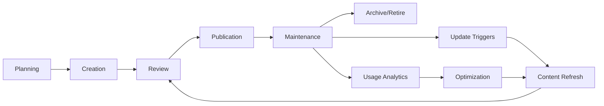

# @h-Documentation-Maintenance-Lifecycle

## 🎯 Learning Objectives
- Develop systematic approaches to documentation maintenance that prevent knowledge decay
- Implement automated monitoring and updating workflows for large-scale documentation
- Create sustainable documentation practices that scale with team and project growth
- Master the balance between comprehensive documentation and maintenance overhead

## 🔧 Documentation Lifecycle Management

### Documentation Lifecycle Phases


### Unity Documentation Maintenance Framework
```csharp
#if UNITY_EDITOR
/// <summary>
/// Automated documentation maintenance system for Unity projects
/// </summary>
public class DocumentationMaintenanceSystem : EditorWindow
{
    private static readonly string DOCS_PATH = "Documentation/";
    private static readonly string MAINTENANCE_LOG = "Documentation/maintenance_log.json";
    
    private DocumentationMaintenanceConfig config;
    private List<DocumentationItem> trackedDocuments;
    private DocumentationHealthReport lastHealthReport;
    
    [MenuItem("Tools/Documentation/Maintenance Dashboard")]
    public static void ShowMaintenanceDashboard()
    {
        GetWindow<DocumentationMaintenanceSystem>("Doc Maintenance");
    }
    
    private void OnEnable()
    {
        LoadMaintenanceConfiguration();
        ScanDocumentationHealth();
    }
    
    private void OnGUI()
    {
        GUILayout.Label("Documentation Maintenance Dashboard", EditorStyles.boldLabel);
        
        if (lastHealthReport != null)
        {
            DisplayHealthOverview();
            DisplayMaintenanceActions();
            DisplayAutomationControls();
        }
        
        EditorGUILayout.Space();
        
        if (GUILayout.Button("Run Health Check"))
        {
            ScanDocumentationHealth();
        }
        
        if (GUILayout.Button("Execute Maintenance Tasks"))
        {
            ExecuteMaintenanceTasks();
        }
        
        if (GUILayout.Button("Generate Maintenance Report"))
        {
            GenerateMaintenanceReport();
        }
    }
    
    private void DisplayHealthOverview()
    {
        EditorGUILayout.LabelField("Documentation Health Overview", EditorStyles.boldLabel);
        
        var healthColor = GetHealthColor(lastHealthReport.OverallHealthScore);
        var originalColor = GUI.color;
        GUI.color = healthColor;
        
        EditorGUILayout.LabelField($"Overall Health Score: {lastHealthReport.OverallHealthScore:P1}");
        GUI.color = originalColor;
        
        EditorGUILayout.LabelField($"Outdated Documents: {lastHealthReport.OutdatedDocuments.Count}");
        EditorGUILayout.LabelField($"Broken Links: {lastHealthReport.BrokenLinks.Count}");
        EditorGUILayout.LabelField($"Missing Dependencies: {lastHealthReport.MissingDependencies.Count}");
        EditorGUILayout.LabelField($"Last Full Scan: {lastHealthReport.LastScanTime:yyyy-MM-dd HH:mm}");
    }
    
    private void ScanDocumentationHealth()
    {
        var healthChecker = new DocumentationHealthChecker();
        lastHealthReport = healthChecker.PerformHealthCheck(DOCS_PATH);
        
        LogMaintenanceActivity("Health Check", $"Scanned {lastHealthReport.TotalDocuments} documents");
        Repaint();
    }
    
    private void ExecuteMaintenanceTasks()
    {
        var executor = new MaintenanceTaskExecutor();
        
        // Update outdated version references
        executor.UpdateVersionReferences(lastHealthReport.OutdatedDocuments);
        
        // Fix broken internal links
        executor.RepairBrokenLinks(lastHealthReport.BrokenLinks);
        
        // Update auto-generated sections
        executor.RefreshAutoGeneratedContent();
        
        // Validate code examples
        executor.ValidateCodeExamples();
        
        LogMaintenanceActivity("Maintenance Execution", "Automated maintenance tasks completed");
        ScanDocumentationHealth(); // Refresh health after maintenance
    }
}

/// <summary>
/// Configuration for documentation maintenance automation
/// </summary>
[System.Serializable]
public class DocumentationMaintenanceConfig
{
    public int healthCheckIntervalDays = 7;
    public int maxOutdatedDays = 30;
    public bool autoUpdateVersionReferences = true;
    public bool autoRepairBrokenLinks = true;
    public bool autoValidateCodeExamples = false;
    public List<string> ignoredPaths = new List<string>();
    public List<string> criticalDocuments = new List<string>();
}

/// <summary>
/// Health assessment results for documentation system
/// </summary>
public class DocumentationHealthReport
{
    public float OverallHealthScore { get; set; }
    public int TotalDocuments { get; set; }
    public List<DocumentationIssue> OutdatedDocuments { get; set; }
    public List<DocumentationIssue> BrokenLinks { get; set; }
    public List<DocumentationIssue> MissingDependencies { get; set; }
    public List<DocumentationIssue> FailedCodeExamples { get; set; }
    public DateTime LastScanTime { get; set; }
    public Dictionary<string, float> CategoryHealthScores { get; set; }
}

/// <summary>
/// Individual documentation maintenance issue
/// </summary>
public class DocumentationIssue
{
    public string FilePath { get; set; }
    public string IssueType { get; set; }
    public string Description { get; set; }
    public string SuggestedFix { get; set; }
    public DocumentationSeverity Severity { get; set; }
    public DateTime DetectedTime { get; set; }
    public bool AutoFixable { get; set; }
}

public enum DocumentationSeverity
{
    Low,        // Cosmetic issues, style inconsistencies
    Medium,     // Outdated information, minor inaccuracies
    High,       // Broken functionality, major inaccuracies
    Critical    // Security issues, completely wrong information
}
#endif
```

## 🚀 AI/LLM Integration Opportunities

### Intelligent Maintenance Automation
```python
# AI-powered documentation maintenance system
class IntelligentDocumentationMaintainer:
    def __init__(self, project_context, maintenance_config):
        self.project_context = project_context
        self.config = maintenance_config
        self.change_analyzer = CodeChangeAnalyzer()
        self.content_updater = AIContentUpdater()
    
    def analyze_maintenance_needs(self, code_changes, documentation_set):
        """Analyze what documentation needs updating based on code changes"""
        maintenance_tasks = []
        
        for change in code_changes:
            affected_docs = self.identify_affected_documentation(change)
            
            for doc in affected_docs:
                impact_analysis = self.analyze_change_impact(change, doc)
                
                if impact_analysis.requires_update:
                    task = MaintenanceTask(
                        document=doc,
                        change=change,
                        update_type=impact_analysis.update_type,
                        priority=impact_analysis.priority,
                        suggested_changes=impact_analysis.suggested_changes
                    )
                    maintenance_tasks.append(task)
        
        return self.prioritize_maintenance_tasks(maintenance_tasks)
    
    def auto_update_documentation(self, maintenance_task):
        """Automatically update documentation with AI assistance"""
        prompt = f"""
        Update this Unity documentation based on code changes:
        
        Original Documentation: {maintenance_task.document.content}
        Code Changes: {maintenance_task.change.summary}
        Change Type: {maintenance_task.change.type}
        
        Requirements:
        - Maintain consistent tone and style
        - Update technical details accurately
        - Preserve existing structure and formatting
        - Add new sections if needed for new functionality
        - Flag any changes that need human review
        
        Project Context: {self.project_context}
        """
        
        updated_content = self.content_updater.generate(prompt)
        confidence_score = self.assess_update_confidence(updated_content, maintenance_task)
        
        return DocumentationUpdate(
            original_content=maintenance_task.document.content,
            updated_content=updated_content,
            confidence_score=confidence_score,
            requires_human_review=confidence_score < 0.8,
            change_summary=self.generate_change_summary(maintenance_task)
        )
    
    def detect_documentation_drift(self, documentation_set, codebase_state):
        """Identify documentation that has drifted from current code reality"""
        drift_issues = []
        
        for doc in documentation_set:
            if doc.type == "api_documentation":
                api_drift = self.analyze_api_drift(doc, codebase_state)
                if api_drift.has_significant_drift:
                    drift_issues.append(api_drift)
            
            elif doc.type == "tutorial":
                tutorial_validity = self.validate_tutorial_steps(doc, codebase_state)
                if not tutorial_validity.all_steps_valid:
                    drift_issues.append(tutorial_validity)
        
        return drift_issues
    
    def suggest_documentation_optimizations(self, usage_analytics, content_analysis):
        """AI-powered suggestions for improving documentation effectiveness"""
        prompt = f"""
        Analyze documentation performance and suggest optimizations:
        
        Usage Analytics: {usage_analytics}
        Content Analysis: {content_analysis}
        
        Identify:
        - Documentation that's rarely accessed but consumes maintenance overhead
        - High-traffic documentation that could be improved for better user experience
        - Missing documentation for frequently asked questions
        - Opportunities to consolidate or reorganize content
        - Sections that could benefit from interactive examples or better formatting
        
        Provide specific, actionable recommendations with implementation priority.
        """
        
        return self.content_updater.analyze(prompt)

# Automated maintenance workflow orchestration
class DocumentationMaintenanceOrchestrator:
    def __init__(self):
        self.scheduled_tasks = []
        self.maintenance_history = []
        self.quality_metrics = DocumentationQualityTracker()
    
    def schedule_maintenance_cycle(self, cycle_config):
        """Schedule regular maintenance activities"""
        maintenance_cycle = MaintenanceCycle(
            health_check_frequency=cycle_config.health_check_days,
            content_refresh_frequency=cycle_config.content_refresh_days,
            link_validation_frequency=cycle_config.link_check_days,
            performance_review_frequency=cycle_config.performance_review_days
        )
        
        return maintenance_cycle.generate_schedule()
    
    def execute_maintenance_workflow(self, workflow_type):
        """Execute specific maintenance workflow"""
        workflow_steps = self.get_workflow_steps(workflow_type)
        execution_results = []
        
        for step in workflow_steps:
            try:
                result = step.execute()
                execution_results.append(result)
                
                if not result.success and step.is_critical:
                    self.handle_critical_failure(step, result)
                    break
                    
            except Exception as e:
                self.handle_workflow_exception(step, e)
                break
        
        return MaintenanceWorkflowResult(
            workflow_type=workflow_type,
            steps_executed=execution_results,
            overall_success=all(r.success for r in execution_results),
            execution_time=self.calculate_execution_time(execution_results)
        )
```

### Predictive Maintenance Intelligence
```python
# Predictive documentation maintenance system
class DocumentationMaintenancePredictor:
    def __init__(self, historical_data):
        self.historical_data = historical_data
        self.decay_models = self.build_decay_models()
        self.usage_patterns = self.analyze_usage_patterns()
    
    def predict_maintenance_needs(self, forecast_days=30):
        """Predict which documentation will need maintenance in the coming period"""
        predictions = []
        
        for doc in self.get_all_documentation():
            decay_prediction = self.predict_content_decay(doc, forecast_days)
            usage_prediction = self.predict_usage_changes(doc, forecast_days)
            
            maintenance_probability = self.calculate_maintenance_probability(
                decay_prediction, usage_prediction, doc.characteristics
            )
            
            if maintenance_probability > 0.7:  # High probability threshold
                predictions.append(MaintenancePrediction(
                    document=doc,
                    predicted_issues=decay_prediction.likely_issues,
                    probability=maintenance_probability,
                    recommended_action_date=decay_prediction.optimal_maintenance_date,
                    effort_estimate=self.estimate_maintenance_effort(doc, decay_prediction)
                ))
        
        return sorted(predictions, key=lambda p: p.probability, reverse=True)
    
    def optimize_maintenance_schedule(self, team_capacity, sprint_schedule):
        """Optimize maintenance timing based on team capacity and development cycles"""
        predictions = self.predict_maintenance_needs(90)  # 3-month forecast
        
        optimization_result = MaintenanceScheduleOptimizer(
            predictions=predictions,
            team_capacity=team_capacity,
            sprint_schedule=sprint_schedule,
            optimization_criteria=['minimize_disruption', 'maximize_coverage', 'balance_workload']
        ).optimize()
        
        return optimization_result.generate_recommended_schedule()
```

## 💡 Maintenance Strategy Patterns

### Proactive vs Reactive Maintenance
```yaml
# Documentation maintenance strategy configuration
maintenance_strategies:
  proactive:
    triggers:
      - code_commit_analysis: detect_api_changes
      - scheduled_reviews: weekly_health_checks
      - usage_analytics: identify_high_impact_docs
      - team_feedback: collect_pain_points
    
    automation_level: high
    resource_allocation: 20_percent_development_time
    quality_gates: strict
    
  reactive:
    triggers:
      - user_reports: outdated_information
      - support_tickets: documentation_issues
      - build_failures: broken_examples
      - team_complaints: unusable_documentation
    
    automation_level: medium
    resource_allocation: on_demand
    quality_gates: moderate

  hybrid:
    critical_documentation: proactive_maintenance
    general_documentation: reactive_maintenance
    experimental_features: minimal_maintenance
    deprecated_features: archive_only
```

### Maintenance Prioritization Framework
```csharp
/// <summary>
/// Documentation maintenance prioritization system
/// </summary>
public class MaintenancePrioritizer
{
    public enum MaintenancePriority
    {
        Critical,    // Security, major inaccuracies, broken core functionality
        High,        // Frequently used docs, API changes, onboarding materials  
        Medium,      // Moderate usage, minor inaccuracies, style inconsistencies
        Low,         // Rarely used, cosmetic issues, nice-to-have improvements
        Deferred     // Can wait for major revision cycles
    }
    
    public MaintenancePriority CalculatePriority(DocumentationItem doc, MaintenanceIssue issue)
    {
        var score = 0;
        
        // Impact assessment
        score += GetImpactScore(doc.UsageFrequency);
        score += GetSeverityScore(issue.Severity);
        score += GetUrgencyScore(issue.TimeSinceDetected);
        score += GetBusinessValueScore(doc.BusinessCriticality);
        
        // Effort consideration (inverse priority for high-effort items)
        score -= GetEffortPenalty(issue.EstimatedFixTime);
        
        return MapScoreToPriority(score);
    }
    
    private int GetImpactScore(DocumentationUsageLevel usage)
    {
        return usage switch
        {
            DocumentationUsageLevel.Critical => 25,    // Daily use by entire team
            DocumentationUsageLevel.High => 20,        // Weekly use by most team
            DocumentationUsageLevel.Medium => 15,      // Monthly use by some team
            DocumentationUsageLevel.Low => 10,         // Occasional use
            DocumentationUsageLevel.Minimal => 5,      // Rarely accessed
            _ => 0
        };
    }
    
    private int GetSeverityScore(DocumentationSeverity severity)
    {
        return severity switch
        {
            DocumentationSeverity.Critical => 30,     // Wrong info that could cause issues
            DocumentationSeverity.High => 20,         // Significantly outdated
            DocumentationSeverity.Medium => 15,       // Minor inaccuracies
            DocumentationSeverity.Low => 10,          // Style or formatting issues
            _ => 0
        };
    }
}

/// <summary>
/// Maintenance task execution planning
/// </summary>
public class MaintenanceTaskPlanner
{
    public MaintenanceExecutionPlan CreateExecutionPlan(
        List<MaintenanceTask> tasks, 
        TeamCapacity capacity,
        ProjectTimeline timeline)
    {
        var plan = new MaintenanceExecutionPlan();
        
        // Group tasks by type for batch execution efficiency
        var taskGroups = GroupTasksByType(tasks);
        
        // Schedule based on priority and dependencies
        foreach (var group in taskGroups.OrderByDescending(g => g.AveragePriority))
        {
            var scheduledGroup = ScheduleTaskGroup(group, capacity, timeline);
            plan.AddScheduledGroup(scheduledGroup);
        }
        
        // Add buffer time for unexpected issues
        plan.AddBufferTime(0.2f); // 20% buffer
        
        // Validate plan feasibility
        if (!plan.IsFeasible(capacity))
        {
            plan = OptimizePlan(plan, capacity);
        }
        
        return plan;
    }
    
    private List<TaskGroup> GroupTasksByType(List<MaintenanceTask> tasks)
    {
        return tasks
            .GroupBy(t => new { t.Type, t.RequiredSkills, t.Tools })
            .Select(g => new TaskGroup
            {
                Tasks = g.ToList(),
                Type = g.Key.Type,
                RequiredSkills = g.Key.RequiredSkills,
                Tools = g.Key.Tools,
                EstimatedDuration = g.Sum(t => t.EstimatedDuration),
                AveragePriority = g.Average(t => (int)t.Priority)
            })
            .ToList();
    }
}
```

## 🛠️ Maintenance Automation Infrastructure

### Continuous Documentation Integration
```yaml
# CI/CD pipeline for documentation maintenance
name: Documentation Maintenance Pipeline

on:
  schedule:
    - cron: '0 2 * * 1'  # Weekly Monday 2 AM
  push:
    paths:
      - 'Assets/**/*.cs'
      - 'Documentation/**/*.md'
  workflow_dispatch:

jobs:
  documentation-health-check:
    runs-on: ubuntu-latest
    steps:
      - uses: actions/checkout@v3
        with:
          fetch-depth: 0  # Full history for change analysis
          
      - name: Analyze Documentation Health
        run: |
          python scripts/documentation_health_checker.py \
            --docs-path Documentation/ \
            --output-format json \
            --severity-threshold medium
            
      - name: Detect Content Drift
        run: |
          python scripts/detect_documentation_drift.py \
            --codebase-path Assets/ \
            --docs-path Documentation/ \
            --change-threshold 0.3
            
      - name: Validate Code Examples
        run: |
          python scripts/validate_code_examples.py \
            --docs-path Documentation/ \
            --unity-project-path . \
            --compilation-test true
            
      - name: Update Outdated References
        if: github.event_name == 'schedule'
        run: |
          python scripts/auto_update_references.py \
            --docs-path Documentation/ \
            --project-version $(cat ProjectSettings/ProjectVersion.txt) \
            --dry-run false
            
      - name: Generate Maintenance Report
        run: |
          python scripts/generate_maintenance_report.py \
            --health-results health_check_results.json \
            --drift-results drift_analysis.json \
            --validation-results validation_results.json \
            --output-path maintenance_report.md
            
      - name: Create Issue for Critical Problems
        if: failure()
        uses: actions/github-script@v6
        with:
          script: |
            github.rest.issues.create({
              owner: context.repo.owner,
              repo: context.repo.repo,
              title: 'Critical Documentation Maintenance Issues Detected',
              body: 'Automated documentation maintenance detected critical issues requiring immediate attention.',
              labels: ['documentation', 'maintenance', 'critical']
            })

  automated-maintenance:
    runs-on: ubuntu-latest
    needs: documentation-health-check
    if: github.event_name == 'schedule'
    steps:
      - name: Execute Safe Maintenance Tasks
        run: |
          python scripts/execute_maintenance_tasks.py \
            --task-types link_fixes,format_updates,version_updates \
            --safety-level conservative \
            --create-pr true
            
      - name: AI-Enhanced Content Updates
        env:
          OPENAI_API_KEY: ${{ secrets.OPENAI_API_KEY }}
        run: |
          python scripts/ai_content_updater.py \
            --maintenance-results maintenance_results.json \
            --update-confidence-threshold 0.8 \
            --human-review-required true
```

### Maintenance Metrics and Monitoring
```csharp
/// <summary>
/// Documentation maintenance metrics collection and analysis
/// </summary>
public class MaintenanceMetricsCollector
{
    private readonly MaintenanceDatabase database;
    private readonly MetricsAggregator aggregator;
    
    public MaintenanceMetrics CollectMetrics(TimeSpan period)
    {
        var endDate = DateTime.UtcNow;
        var startDate = endDate - period;
        
        var metrics = new MaintenanceMetrics
        {
            Period = period,
            
            // Maintenance activity metrics
            TotalMaintenanceTasks = GetMaintenanceTaskCount(startDate, endDate),
            AutomatedTasksPercentage = GetAutomationRate(startDate, endDate),
            AverageTaskCompletionTime = GetAverageCompletionTime(startDate, endDate),
            MaintenanceEfficiency = CalculateMaintenanceEfficiency(startDate, endDate),
            
            // Documentation health metrics
            DocumentationHealthTrend = GetHealthTrend(startDate, endDate),
            OutdatedDocumentsTrend = GetOutdatedDocumentsTrend(startDate, endDate),
            BrokenLinksResolutionRate = GetBrokenLinksResolutionRate(startDate, endDate),
            
            // Team productivity impact
            MaintenanceToDevTimeRatio = GetMaintenanceToDevTimeRatio(startDate, endDate),
            DocumentationUsageIncrease = GetUsageIncrease(startDate, endDate),
            SupportTicketReduction = GetSupportTicketReduction(startDate, endDate),
            
            // Quality improvements
            ContentAccuracyImprovement = GetAccuracyImprovement(startDate, endDate),
            UserSatisfactionScore = GetUserSatisfactionScore(startDate, endDate),
            MaintenanceCostEfficiency = CalculateCostEfficiency(startDate, endDate)
        };
        
        return metrics;
    }
    
    public MaintenanceInsights GenerateInsights(MaintenanceMetrics metrics)
    {
        var insights = new MaintenanceInsights();
        
        // Identify maintenance bottlenecks
        insights.Bottlenecks = IdentifyMaintenanceBottlenecks(metrics);
        
        // Suggest optimization opportunities
        insights.OptimizationOpportunities = SuggestOptimizations(metrics);
        
        // Predict future maintenance needs
        insights.FutureMaintenanceNeeds = PredictMaintenanceNeeds(metrics);
        
        // Calculate ROI of maintenance investments
        insights.MaintenanceROI = CalculateMaintenanceROI(metrics);
        
        return insights;
    }
}

public class MaintenanceMetrics
{
    public TimeSpan Period { get; set; }
    
    // Activity metrics
    public int TotalMaintenanceTasks { get; set; }
    public float AutomatedTasksPercentage { get; set; }
    public TimeSpan AverageTaskCompletionTime { get; set; }
    public float MaintenanceEfficiency { get; set; }
    
    // Health metrics
    public HealthTrendData DocumentationHealthTrend { get; set; }
    public TrendData<int> OutdatedDocumentsTrend { get; set; }
    public float BrokenLinksResolutionRate { get; set; }
    
    // Impact metrics
    public float MaintenanceToDevTimeRatio { get; set; }
    public float DocumentationUsageIncrease { get; set; }
    public float SupportTicketReduction { get; set; }
    
    // Quality metrics
    public float ContentAccuracyImprovement { get; set; }
    public float UserSatisfactionScore { get; set; }
    public float MaintenanceCostEfficiency { get; set; }
}
```

## 🎯 Sustainable Maintenance Practices

### Long-term Sustainability Framework
```markdown
# Documentation Maintenance Sustainability

## Principle 1: Maintenance as Development Practice
- **Integration**: Maintenance tasks integrated into development sprints
- **Ownership**: Developers responsible for maintaining their documentation
- **Tooling**: Automated tools reduce manual maintenance overhead
- **Culture**: Team culture values documentation maintenance

## Principle 2: Scalable Automation
- **Progressive Automation**: Start with high-impact, low-risk automation
- **AI Augmentation**: Use AI to assist, not replace, human judgment
- **Quality Gates**: Automated quality checks prevent maintenance debt
- **Feedback Loops**: Continuous improvement based on maintenance effectiveness

## Principle 3: Strategic Resource Allocation
- **Priority-Driven**: Focus maintenance effort on high-impact documentation
- **Capacity Planning**: Reserve percentage of development time for maintenance
- **Skill Development**: Team members develop maintenance automation skills
- **ROI Tracking**: Measure and optimize maintenance return on investment
```

### Maintenance Team Roles and Responsibilities
```yaml
# Documentation maintenance team structure
maintenance_team_structure:
  documentation_steward:
    responsibilities:
      - oversee_maintenance_strategy
      - coordinate_team_maintenance_efforts
      - monitor_documentation_health_metrics
      - make_strategic_maintenance_decisions
    
    time_allocation: 25_percent_role
    skills_required: [technical_writing, process_optimization, team_coordination]
    
  automation_engineer:
    responsibilities:
      - develop_maintenance_automation_tools
      - integrate_ai_assistance_workflows
      - optimize_maintenance_pipelines
      - troubleshoot_automation_issues
    
    time_allocation: 50_percent_role
    skills_required: [python_scripting, unity_editor_extensions, ci_cd_pipelines]
    
  content_maintainers:
    responsibilities:
      - execute_routine_maintenance_tasks
      - review_ai_generated_content_updates
      - validate_automated_maintenance_results
      - contribute_to_maintenance_process_improvement
    
    time_allocation: 10_percent_per_developer
    skills_required: [domain_expertise, technical_writing, quality_assessment]
```

## 🎯 Career Application

### Professional Maintenance Portfolio
- **Process Documentation**: Examples of maintenance systems you've created or improved
- **Automation Projects**: Custom tools and scripts for documentation maintenance
- **Metrics and ROI**: Quantified impact of maintenance improvements on team productivity
- **Sustainability Strategies**: Long-term approaches to maintaining documentation quality at scale

### Interview Demonstration Points
- Explain the business case for systematic documentation maintenance
- Discuss challenges in scaling documentation maintenance across large teams
- Present specific examples of maintenance automation reducing overhead
- Describe strategies for maintaining documentation quality without excessive burden

### Leadership and Innovation
- **Strategic Thinking**: Understanding documentation maintenance as investment, not cost
- **Technical Innovation**: Creative automation solutions for maintenance challenges
- **Team Development**: Building team capabilities in maintenance best practices
- **Process Improvement**: Continuous optimization of maintenance workflows and effectiveness