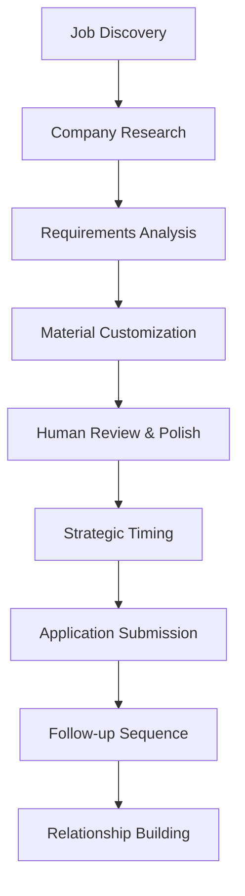

# @e-Job-Application-Automation-Strategies

## 🎯 Learning Objectives
- Build automated job discovery and application pipelines
- Create AI-powered application material customization systems
- Develop stealth automation for maximum efficiency without detection
- Establish systematic follow-up and relationship building processes

## 🔧 Core Automation Architecture

### Job Discovery Pipeline
```yaml
Data Sources:
- LinkedIn Jobs API integration
- Indeed/Glassdoor scraping (respectful rate limits)
- Company career page monitoring
- Unity Jobs Board automation
- Game industry slack channels monitoring

Filtering Logic:
- Unity/C# keyword matching
- Location preferences (remote-friendly)
- Company size and funding stage
- Salary range analysis
- Cultural fit indicators
```

### Application Material Generation System
```python
# AI-Powered Customization Framework
application_components = {
    "cover_letter": {
        "template": "base_unity_developer_template.md",
        "customization_points": [
            "company_specific_research",
            "role_requirements_matching", 
            "project_portfolio_selection",
            "cultural_values_alignment"
        ]
    },
    "resume": {
        "sections_to_adapt": [
            "professional_summary",
            "technical_skills_ordering",
            "project_highlights",
            "achievement_quantification"
        ]
    }
}

# Prompt Engineering for Applications
def generate_cover_letter_prompt(job_description, company_info):
    return f"""
    Create a cover letter for a Unity Developer position based on:
    Job Description: {job_description}
    Company Research: {company_info}
    
    Requirements:
    - Highlight relevant Unity projects without overstating
    - Match technical keywords naturally
    - Show genuine interest in company's games/mission
    - Keep under 250 words, professional but personable tone
    - Include subtle productivity/efficiency hints without mentioning AI
    """
```

## 🚀 AI/LLM Integration Opportunities

### Intelligent Job Matching
```markdown
# AI-Powered Application Strategy

## Job Description Analysis
- Extract required vs preferred skills
- Identify company culture indicators
- Analyze salary and benefits patterns
- Map decision maker hierarchy
- Research recent company news/challenges

## Application Customization
- Dynamically reorder resume sections based on job requirements
- Generate role-specific portfolio project descriptions
- Create targeted technical skill demonstrations
- Develop company-specific value propositions
```

### Automated Research Pipeline
```bash
# Company Intelligence Gathering
research_automation:
  - Recent Unity job postings analysis
  - LinkedIn employee background patterns
  - Glassdoor review sentiment analysis
  - Recent game releases and reception
  - Technical blog content analysis
  - Conference speaking engagement tracking

# Decision Maker Identification  
networking_prep:
  - Engineering manager profiles
  - HR/talent acquisition team mapping
  - Unity developer team leads
  - Warm introduction path analysis
```

### Application Tracking and Optimization
```yaml
ATS Optimization:
- Keyword density analysis and optimization
- Format compatibility testing
- Section ordering for maximum impact
- File naming convention standardization

Performance Tracking:
- Application-to-response rate by company type
- Cover letter variant A/B testing
- Resume format effectiveness analysis
- Follow-up timing optimization
```

## 💡 Key Highlights

### **Stealth Automation Principles**
```yaml
Golden Rules:
- Never mention AI tools in applications or interviews
- Frame efficiency as "systematic approach" or "process optimization"
- Always add human touch to final outputs
- Maintain consistent voice across all materials
- Use AI for research and drafting, humans for final approval

Detection Avoidance:
- Vary writing style between applications
- Include occasional minor imperfections
- Reference specific details that require human research
- Use conversational language patterns
- Maintain authentic personality markers
```

### **High-Impact Application Workflow**


### **Resume Adaptation Strategy**
```yaml
Dynamic Sections:
  Technical Skills:
    - Reorder based on job requirements
    - Emphasize relevant Unity subsystems
    - Include specific C# patterns mentioned
    - Match architectural preferences
  
  Project Descriptions:
    - Select most relevant 3-4 projects
    - Customize technical details for audience
    - Quantify impact when possible
    - Align with company's game genres

  Professional Summary:
    - Mirror company culture language
    - Emphasize matching experience level
    - Include subtle efficiency/productivity hints
    - Reference specific technologies mentioned
```

### **Follow-up Automation System**
```python
# Strategic Follow-up Timeline
follow_up_sequence = {
    "day_3": "Thank you note with additional relevant portfolio piece",
    "day_7": "Share relevant Unity article with personal insight",
    "day_14": "LinkedIn connection request with personalized note",
    "day_21": "Soft check-in with value-add (not just status request)",
    "day_30": "Final follow-up with alternative collaboration suggestion"
}

# AI-Generated Follow-up Content
def generate_follow_up(stage, company_context, application_details):
    prompts = {
        "thank_you": "Create a brief thank you email that references specific details from the job posting and includes a relevant portfolio link.",
        "value_add": "Generate a follow-up that shares a relevant Unity development insight without being pushy about the application status.",
        "connection_request": "Write a LinkedIn connection request that references the application but focuses on industry networking value."
    }
```

## 🎮 Unity-Specific Application Tactics

### Portfolio Integration Strategy
```markdown
# Technical Demonstration Approach

## Interactive Portfolio Elements
- WebGL builds embedded in personal website
- GitHub repositories with detailed README documentation
- Video walkthroughs of complex systems
- Technical blog posts explaining implementation choices

## Role-Specific Portfolio Curation
- Mobile Game Studios: Focus on performance optimization examples
- VR/AR Companies: Highlight spatial interaction systems  
- Indie Studios: Show versatility and full-stack capabilities
- Enterprise/Serious Games: Emphasize UX and accessibility features
```

### Technical Assessment Preparation
```yaml
Common Unity Interview Challenges:
- Object pooling implementation
- Coroutine vs async/await usage patterns
- Performance profiling and optimization
- Component-based architecture design
- Platform-specific considerations

AI-Assisted Preparation:
- Generate practice problems with solutions
- Create explanation templates for common concepts
- Develop portfolio project talking points
- Practice technical communication skills
```

### Network-Based Application Strategy
```yaml
Warm Introduction Paths:
1. Unity meetup organizers → company developers
2. Former colleagues → hiring managers  
3. Open source contributors → technical leads
4. Conference speakers → decision makers
5. LinkedIn mutual connections → internal referrals

Relationship Building Automation:
- Track interaction history with potential referrers
- Generate conversation starters based on shared interests
- Monitor for mutual connection opportunities
- Create value-first outreach sequences
```

This system transforms job applications from time-consuming manual work into a strategic, data-driven process that maximizes opportunities while maintaining authentic human connection.