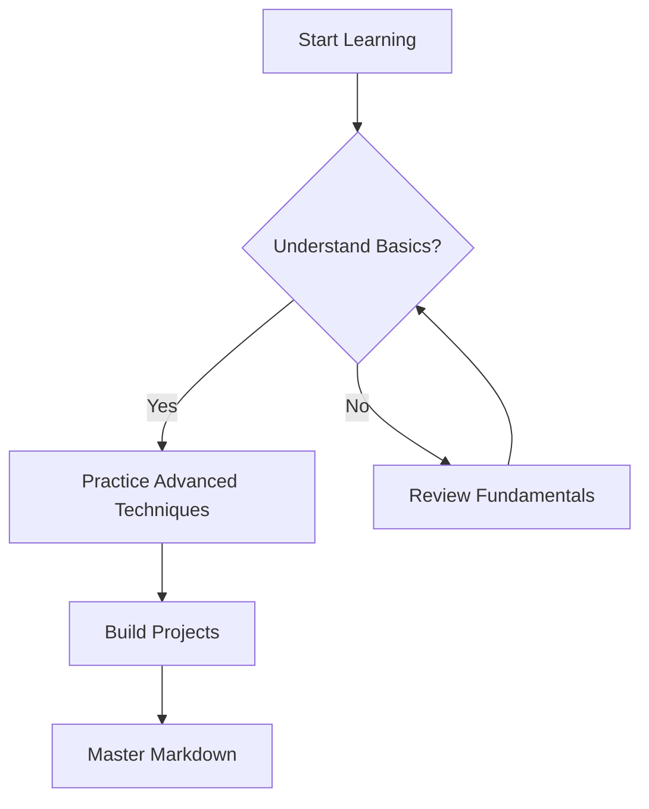
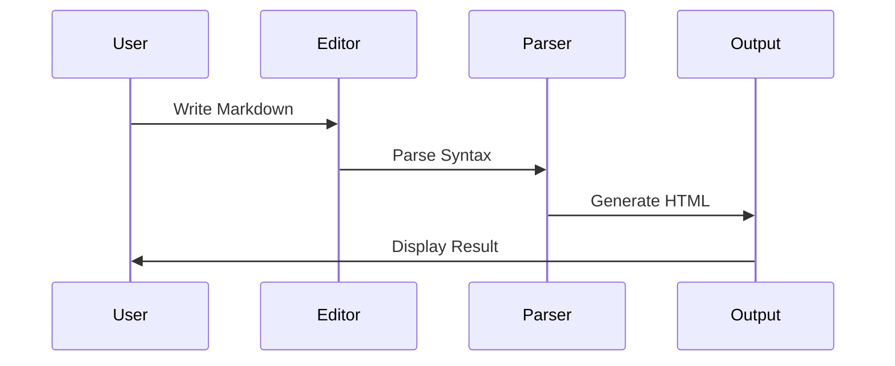
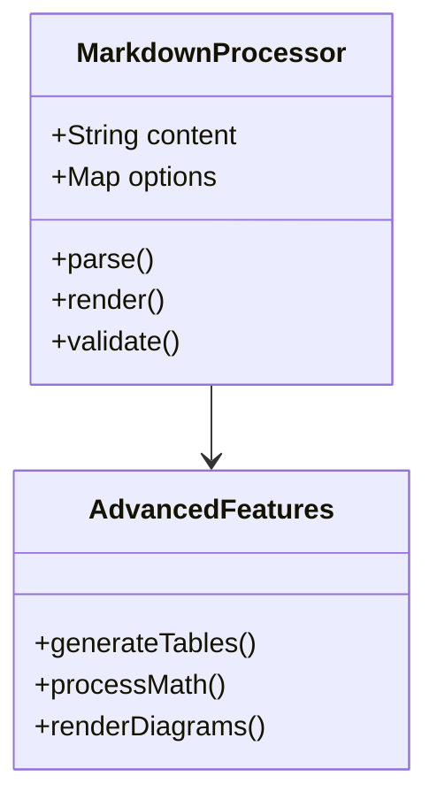

# @b-Advanced Markdown Techniques

## 🎯 Learning Objectives
- Master complex markdown formatting for professional documentation
- Implement advanced content organization and presentation techniques
- Leverage markdown extensions and modern features for enhanced productivity
- Build sophisticated knowledge management systems using advanced markdown

## 🔧 Advanced Formatting Techniques

### Complex Table Structures
```markdown
| Feature | Basic | Advanced | Pro |
|---------|-------|----------|-----|
| Syntax Highlighting | ✅ | ✅ | ✅ |
| Table Alignment | ❌ | ✅ | ✅ |
| Merged Cells | ❌ | ❌ | ✅ |
| **Price** | Free | $10/mo | $25/mo |

Alignment Control:
| Left | Center | Right |
|:-----|:------:|------:|
| Text | Text | Text |
| More | More | More |

Complex Data Tables:
| Concept | Implementation | Complexity | Time Investment |
|---------|---------------|------------|-----------------|
| **Variables** | `let name = "value"` | 🟢 Low | 15 min |
| **Functions** | `function calc() {}` | 🟡 Medium | 45 min |
| **Classes** | `class MyClass {}` | 🔴 High | 2 hours |
```

### Mathematical and Scientific Notation
```markdown
Inline Math: $E = mc^2$

Block Equations:
$$
\sum_{i=1}^{n} x_i = x_1 + x_2 + \cdots + x_n
$$

Chemical Formulas: H₂O, CO₂, C₆H₁₂O₆

Technical Notation:
- Temperature: 25°C (77°F)
- Measurements: 5.2 × 10³ kg
- Percentages: Performance improved by ~15%
```

### Advanced Code Block Features
````markdown
Multi-language Code Blocks:
```javascript
// JavaScript implementation
const processData = (data) => {
    return data.map(item => ({
        ...item,
        processed: true
    }));
};
```

```python
# Python equivalent
def process_data(data):
    return [
        {**item, 'processed': True}
        for item in data
    ]
```

Code with Line Numbers and Highlighting:
```python {.line-numbers}
def fibonacci(n):
    if n <= 1:
        return n
    return fibonacci(n-1) + fibonacci(n-2)  # Recursive approach

# Iterative optimization
def fibonacci_optimized(n):
    a, b = 0, 1
    for _ in range(n):
        a, b = b, a + b
    return a
```

Diff Syntax for Changes:
```diff
  function calculateTotal(items) {
-   return items.reduce((sum, item) => sum + item, 0);
+   return items.reduce((sum, item) => sum + item.price, 0);
  }
```
````

## 🚀 AI/LLM Integration Opportunities

### Advanced Content Generation
```yaml
AI-Powered Advanced Formatting:
  - Automated table generation from data sets
  - Mathematical formula conversion from natural language
  - Code example generation with multiple language versions
  - Complex diagram creation using mermaid syntax

Smart Document Enhancement:
  - Automatic link validation and updates
  - Content structure optimization suggestions
  - Cross-reference generation and maintenance
  - Version comparison and change tracking
```

### Intelligent Content Organization
```yaml
AI-Enhanced Document Architecture:
  - Automated heading hierarchy optimization
  - Content gap analysis and recommendations
  - Semantic linking between related concepts
  - Dynamic table of contents with smart navigation
```

## 💡 Advanced Content Presentation

### Interactive Elements and Media
```markdown
Collapsible Sections:
<details>
<summary>Click to expand advanced configuration</summary>

### Advanced Configuration Options
- Option 1: Complex setting explanation
- Option 2: Advanced feature toggle
- Option 3: Performance optimization settings

```yaml
advanced_config:
  performance: high
  caching: enabled
  optimization: aggressive
```
</details>

HTML Integration for Complex Layout:
<div style="display: flex; gap: 20px;">
<div style="flex: 1;">

**Left Column Content**
- Point A
- Point B
- Point C

</div>
<div style="flex: 1;">

**Right Column Content**
- Comparison A
- Comparison B  
- Comparison C

</div>
</div>

Progress Indicators:
Learning Progress: ████████░░ 80%
Skill Level: ██████████ Expert
```

### Advanced Linking and References
```markdown
Cross-Document Linking Systems:
[Core Concepts](./01-fundamentals.md#core-concepts)
[Related Topic](./../related-category/topic.md)
[External Resource](https://example.com "Tooltip description")

Anchor Links for Navigation:
[Jump to Implementation](#implementation-details)
[Back to Top](#advanced-markdown-techniques)

Reference-Style Links:
This is a reference to [advanced techniques][1] and [optimization strategies][2].

[1]: https://advanced-markdown.com
[2]: https://optimization-guide.com "Performance optimization"

Footnote System for Citations:
Advanced markdown supports complex formatting[^1] and custom extensions[^2].

[^1]: Including mathematical notation, diagrams, and interactive elements
[^2]: Such as mermaid diagrams, custom HTML components, and plugin integrations
```

## 🔧 Diagram and Visualization Integration

### Mermaid Diagrams
````markdown
Flowchart Diagrams:


Sequence Diagrams:


Class Diagrams:

````

### Custom Visualization Patterns
```markdown
ASCII Art and Diagrams:
```
Learning Path Visualization:
Fundamentals ──> Advanced ──> Mastery
     │              │           │
     ▼              ▼           ▼
  Syntax        Extensions   Automation
  Basics        Plugins      Integration
  Practice      Diagrams     AI-Enhanced
```

Progress Tracking:
```
Knowledge Acquisition Map:
┌─────────────────────────────────────────┐
│ Markdown Mastery Progress               │
├─────────────────────────────────────────┤
│ ████████████████████████████████░░ 90%  │ Fundamentals
│ ████████████████████░░░░░░░░░░░░░░ 60%  │ Advanced Syntax
│ ████████████░░░░░░░░░░░░░░░░░░░░░░ 40%  │ Integrations
│ ██████░░░░░░░░░░░░░░░░░░░░░░░░░░░░ 20%  │ Automation
└─────────────────────────────────────────┘
```
```

## 🎯 Advanced Workflow Patterns

### Multi-Document Management
```markdown
Document Relationship Mapping:
```yaml
knowledge_system:
  core_documents:
    - fundamentals.md
    - advanced-techniques.md
    - integration-guide.md
  
  cross_references:
    fundamentals: [advanced-techniques, integration-guide]
    advanced-techniques: [fundamentals, specialized-topics]
    integration-guide: [all-documents]
  
  update_propagation:
    - automatic link validation
    - content synchronization
    - version consistency checks
```

Template System for Consistency:
```markdown
Document Header Template:
---
title: "Document Title"
category: "Learning Category"
difficulty: "Beginner|Intermediate|Advanced"
estimated_time: "XX minutes"
prerequisites: ["Prerequisite 1", "Prerequisite 2"]
related_topics: ["Topic A", "Topic B", "Topic C"]
last_updated: "YYYY-MM-DD"
version: "1.0"
---

# Document Title

[Standard learning objective format]
[Consistent content structure]
[Standardized conclusion format]
```
```

### Version Control Integration
```markdown
Git-Optimized Markdown:
- Consistent line breaks for clean diffs
- Logical section organization for merge conflicts
- Descriptive commit messages for documentation changes
- Branch strategies for content development

Change Tracking Patterns:
```diff
## Updated Section
- Old implementation approach
+ New optimized approach with better performance

### Added Features
+ New advanced technique for complex scenarios
+ Integration with modern tools and workflows
```

Collaborative Documentation:
- Clear authorship attribution
- Review and approval workflows  
- Change request documentation
- Version history maintenance
```

## 🚀 Automation and Productivity Enhancement

### Content Generation Automation
```yaml
Automated Workflows:
  table_generation:
    - CSV to markdown table conversion
    - Database query result formatting
    - Spreadsheet data integration
  
  code_documentation:
    - Function signature extraction
    - API documentation generation
    - Code example compilation
  
  cross_reference_management:
    - Broken link detection and repair
    - Reference consistency validation
    - Automatic index generation
```

### AI-Enhanced Content Development
```yaml
LLM Integration Patterns:
  content_enhancement:
    - Grammar and style optimization
    - Technical accuracy validation
    - Readability improvement suggestions
  
  structure_optimization:
    - Heading hierarchy analysis
    - Content flow improvement
    - Section balance recommendations
  
  knowledge_synthesis:
    - Multi-source content integration
    - Concept relationship mapping
    - Learning path optimization
```

## 💡 Advanced Best Practices

### Performance-Optimized Documentation
```markdown
Efficient Document Structure:
- Front-load critical information
- Use progressive disclosure for complex topics
- Implement logical information hierarchy
- Balance detail with accessibility

Large Document Management:
- Strategic use of internal linking
- Modular content organization
- Cross-reference optimization
- Search-friendly formatting

Mobile-Responsive Patterns:
- Concise section headers
- Scannable bullet point structures
- Appropriate white space usage
- Touch-friendly navigation elements
```

### Advanced Accessibility Features
```markdown
Inclusive Design Principles:
- Alt text for all visual elements
- Semantic heading structures
- Color-independent information design
- Screen reader optimized content

Universal Usability:
- Clear language and terminology
- Consistent navigation patterns
- Multiple learning modalities
- Cultural and linguistic considerations
```

## 🔧 Platform-Specific Optimizations

### Obsidian Advanced Features
```markdown
Obsidian-Specific Enhancements:
- [[Wiki-style linking]] for knowledge graphs
- #tags for content organization
- Block references for precise linking
- Dataview queries for dynamic content

Plugin Integration:
- Calendar integration for time-based content
- Kanban boards for project management
- Advanced table plugins for data presentation
- Custom CSS for personalized styling
```

### GitHub-Flavored Markdown Extensions
```markdown
GitHub-Specific Features:
- [x] Task lists with completion tracking
- @username mentions for collaboration
- #issue-number references for project management
- :emoji: support for enhanced expression

Repository Integration:
- README optimization for project visibility
- Wiki page structuring for documentation
- Issue template creation for consistency
- Pull request documentation standards
```

This advanced markdown foundation enables sophisticated documentation systems, enhanced learning experiences, and automated workflow integration for maximum productivity and knowledge management effectiveness.